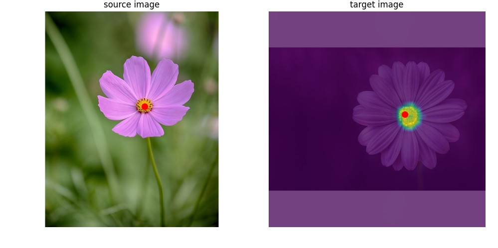

# 🔍 DINOv2 Feature Matching Demo

This demo allows you to interactively visualize pixel-level feature correspondences between two images using **DINOv2** features.

## 🧠 Overview

Using powerful vision transformer embeddings from DINOv2, this tool lets you click on one image and instantly see the best-matching point in the second image. It's ideal for visualizing self-supervised feature representations and understanding how DINOv2 perceives image similarity.

---

## 📦 Requirements

This repository has been tested with the following packages. It may work with older versions, but we recommend these for optimal GPU efficiency.
- `torch==2.7.1`
- `xformers==0.0.31.post1`
- `triton`
- `Pillow`
- `Flask`
- Your custom modules: `resize`, `get_dino_features`, and `PixelMatcher`

Make sure your environment has a working GPU setup for efficient feature extraction.

---

## 🚀 Getting Started

### 1. Start the DINOv2 feature server

```bash
python dino_server.py
```

This starts a local server that extracts features using DINOv2. Make sure it stays running in the background while using the demo.

### 2. Launch the matching demo

```bash
python see_features_dinov2.py image1.png image2.png
```

Replace `image1.png` and `image2.png` with paths to your own images. After launching, an interactive plot will open. Click on the first image to see the best match in the second.

---

## 🖼️ Example

<p align="center">
  
</p>

---

## 🧩 How It Works

- **Image Preprocessing**: Resizes both images to a fixed resolution (default: `640x640`) with white background padding.
- **Feature Extraction**: Uses DINOv2 ViT features (via the server) to compute dense descriptors.
- **Pixel Matching**: When a pixel is clicked in one image, the nearest feature match is computed in the other image and visualized.

---

## 🛠 Developer Notes

- Make sure to keep `dino_server.py` running while using the matching interface.
- CUDA memory is cleaned between runs using `torch.cuda.empty_cache()` and `torch.cuda.ipc_collect()`.

---

## 📁 File Structure

```bash
.
├── dino_server.py              # DINOv2 feature extraction server
├── see_features_dinov2.py      # Main script for launching the matching UI
├── pixel_matcher.py            # Your pixel matcher module
└── README.md                   # You're here!
```

---

## 🧠 Credits

- [DINOv2 by Meta AI](https://github.com/facebookresearch/dinov2)
